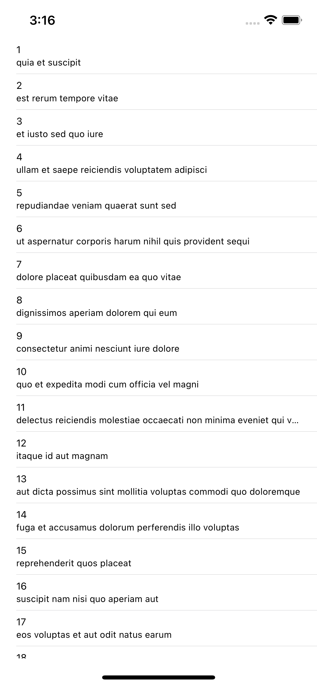

# MVC_DESIGN_PATTERN

# Screenshots

## This is how app looks after fetching the api data from the URL...

# How to clone this ToDo App?
## git clone https://github.com/the-hsr/MVC_Design_Pattern.git
## If first time user then you might be asked to configure the user in git(P.S google it, it's simple)
## After cloning just run it (for MacOS command+R)
